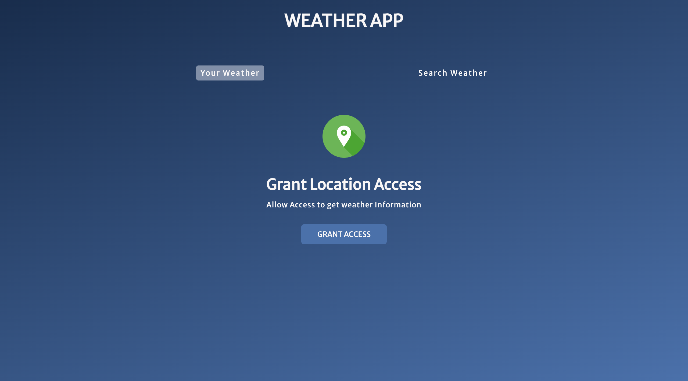
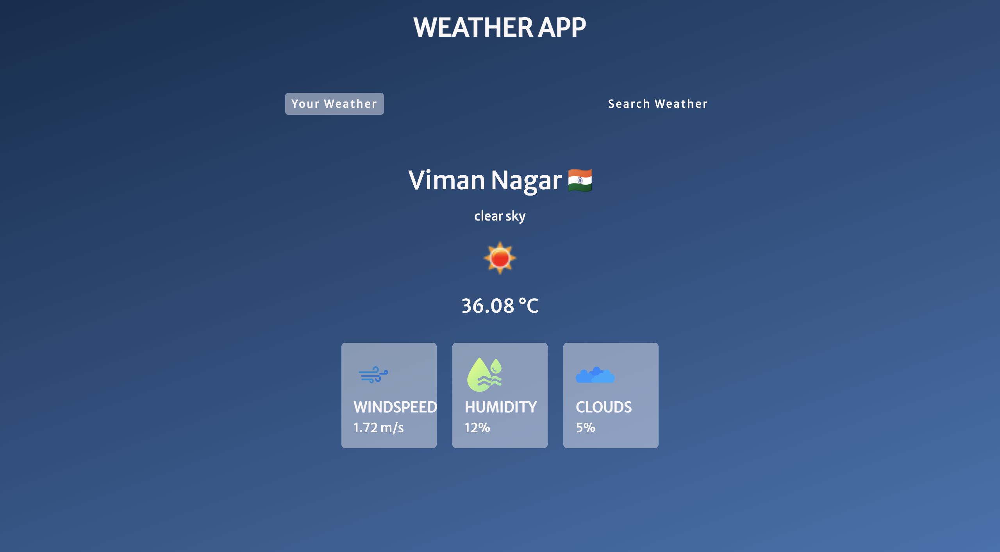
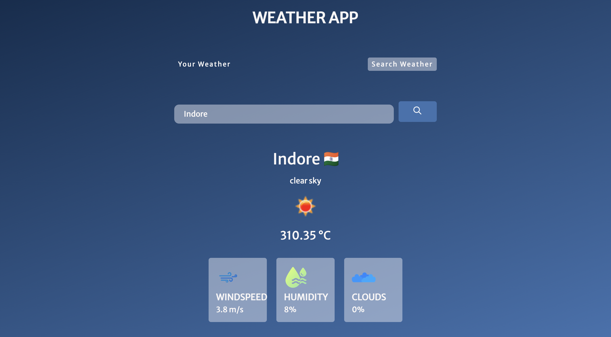

# ⛅ ShowWeather Web App

**ShowWeather** is a simple and elegant weather application built using **HTML, CSS, and JavaScript**. It allows users to check real-time weather information for any city using a clean and user-friendly interface.

---

## 🌟 Features

- 🌍 Search weather by city name
- 🌡️ Display temperature, weather conditions, and location
- 🌫️ Real-time data using public weather API (e.g., OpenWeatherMap)
- 📱 Responsive and minimal UI

---

## 🛠 Technologies Used

- **HTML** – Structure and content
- **CSS** – Styling and layout
- **JavaScript** – API calls and dynamic content rendering

---

## 🌟 Screenshots

> 
> 
> 

---

## 📦 Setup & Usage

1. Clone the repository:

```bash
git clone https://github.com/paveshkanungo/showWeather-Project.git
cd showWeather-Project
```

---
